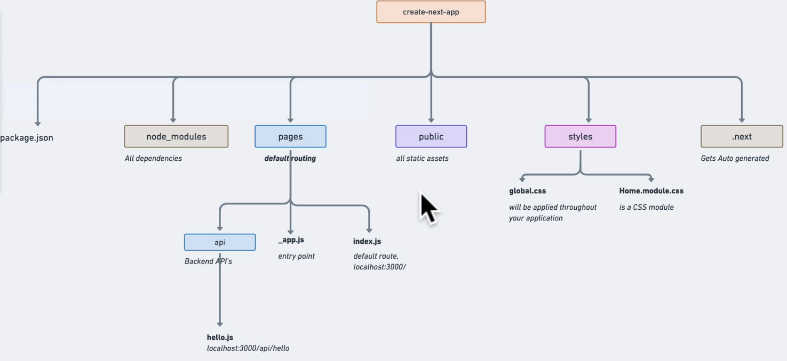

### https://academy.zerotomastery.io/p/learn-next-js

#### Course Repo

https://github.com/kulkarniankita/discover-coffee-stores
https://github.com/kulkarniankita/discover-coffeeStore-next-js-app

### Setup

Install

```ts
yarn create next-app --typescript
```



pages folder structure is the default routing schema

for example:
folder /pages/index.tsx -> localhost:3000/
folder /pages/hello.tsx -> localhost:3000/hello
folder /pages/orders/index.tsx -> localhost:3000/orders

\_app.tsx is the entry point of our application

### `src` Directory

[Official Documentation](https://nextjs.org/docs/advanced-features/src-directory)

Pages can also be added under src/pages as an alternative to the root pages directory.

The `src directory` is very common in many apps and Next.js supports it by default.

Config files like `next.config.js` and `tsconfig.json`, as well as environment variables, should be inside the **root directory**, moving them to `src` won't work. Same goes for the public directory

#### When to use JSX.Element vs ReactNode vs ReactElement

A ReactElement is an object with a type and props

```ts
type Key = string | number

interface ReactElement<
  P = any,
  T extends string | JSXElementConstructor<any> =
    | string
    | JSXElementConstructor<any>
> {
  type: T
  props: P
  key: Key | null
}
```

A ReactNode is a ReactElement, a ReactFragment, a string, a number or an array of ReactNodes, or null, or undefined, or a boolean:

```ts
type ReactText = string | number
type ReactChild = ReactElement | ReactText

interface ReactNodeArray extends Array<ReactNode> {}
type ReactFragment = {} | ReactNodeArray

type ReactNode =
  | ReactChild
  | ReactFragment
  | ReactPortal
  | boolean
  | null
  | undefined
```

JSX.Element is a ReactElement, with the generic type for props and type being any. It exists, as various libraries can implement JSX in their own way, therefore JSX is a global namespace that then gets set by the library, React sets it like this:

```ts
declare global {
  namespace JSX {
    interface Element extends React.ReactElement<any, any> {}
  }
}
```

#### Layouts in Next.js

Page-level layout vs global layout

Let's say we have 2 layouts, the `MainLayout` is for the most of the pages, whereas the `SecondLayout` is for the `Hello` page only

layouts/MainLayout.tsx (a simple wrapper function that wraps children components with Navbar and Footer)

```tsx
import React, { ReactElement } from 'react'
import Footer from '../components/Footer'
import Navbar from '../components/Navbar'

const MainLayout = ({ children }: { children: ReactElement }) => {
  return (
    <>
      <Navbar />
      <main>{children}</main>
      <Footer />
    </>
  )
}

export default MainLayout
```

layouts/SecondLayout.tsx (also a wrapper function)

```tsx
import React, { ReactElement } from 'react'

const SecondLayout = ({ children }: { children: ReactElement }) => {
  return (
    <>
      <main>{children}</main>
    </>
  )
}

export default SecondLayout
```

Now is our `Hello` page, it has a getLayout function, which wrap the page parameter with `SecondLayout`

```tsx
import { NextPage } from 'next'
import React, { ReactElement, ReactNode } from 'react'
import SecondLayout from '../layouts/SecondLayout'

export type NextPageWithLayout = NextPage & {
  getLayout?: (page: ReactElement) => ReactNode
}

const Hello: NextPageWithLayout = () => {
  return <div>Hello World!</div>
}

Hello.getLayout = (page: ReactElement) => {
  return <SecondLayout>{page}</SecondLayout>
}

export default Hello
```

Now setup the layout in \_app.tsx

```tsx
import '../styles/globals.css'
import type { AppProps } from 'next/app'
import MainLayout from '../layouts/MainLayout'
import { ReactElement } from 'react'
import { NextPageWithLayout } from './hello'

type AppPropsWithLayout = AppProps & {
  Component: NextPageWithLayout
}

function MyApp({ Component, pageProps }: AppPropsWithLayout) {
  // Use the layout defined at the page level, if available
  // otherwise always use the `MainLayout`
  const getLayout =
    Component.getLayout ??
    ((page: ReactElement) => <MainLayout>{page}</MainLayout>)

  return getLayout(<Component {...pageProps} />)
}

export default MyApp
```

#### Fast Refresh

Fast Refresh is a Next.js feature that gives you instantaneous feedback on edits made to your React components. Fast Refresh is enabled by default in all Next.js applications on 9.4 or newer. With Next.js Fast Refresh enabled, most edits should be visible within a second, without losing component state.

#### CSS-Modules

[css-modules](https://github.com/css-modules/css-modules) is provided by Next.js out of the box

A `CSS Module` is a `CSS file` in which all class names and animation names are **scoped locally** by default.

### Add `Roboto` webfont from Google font

[Font Optimization official documentation](https://nextjs.org/docs/basic-features/font-optimization)

By default, Next.js abstracts away the <html> and <body> tags on your pages.

We need to create a custom file `page/_document.tsx`

`<link rel="preconnect">` informs the browser that your page intends to establish a connection to another origin, and that you'd like the process to start as soon as possible.

If the assets use CORS, `crossorigin` is needed. If CORS won't be used, `crossorigin` should be omitted

```tsx
import Document, { Html, Head, Main, NextScript } from 'next/document'

class MyDocument extends Document {
  render() {
    return (
      <Html>
        <Head>
          <link rel="preconnect" href="https://fonts.googleapis.com" />
          <link
            rel="preconnect"
            href="https://fonts.gstatic.com"
            crossOrigin="true"
          />
          <link
            href="https://fonts.googleapis.com/css2?family=Roboto:wght@100&display=swap"
            rel="stylesheet"
          />
        </Head>
        <body>
          <Main />
          <NextScript />
        </body>
      </Html>
    )
  }
}

export default MyDocument
```

### Add MUI 5 to next.js

Reference:
[Get Started with Material UI and Next.js in TypeScript](https://blog.sycamore.design/material-ui-next-js-typescript)

Step 01. Add emotion & mui

```
yarn add @emotion/cache @emotion/react @emotion/server @emotion/styled

yarn add @mui/material @mui/icons-material
```

Step 02: Create a basic theme

`src/themes/defaultTheme.ts`

```ts
import { createTheme } from '@mui/material/styles'
import { grey } from '@mui/material/colors'

const theme = createTheme({
  palette: {
    primary: {
      main: grey.A400
    },
    secondary: {
      main: '#ff6666'
    }
  }
})

export default theme
```

Step 03: Create a Emotion Cache

```ts
import createCache from '@emotion/cache'

export default function createEmotionCache() {
  // prepend class name with 'css-'
  return createCache({ key: 'css', prepend: true })
}
```

Step 04: Modify the `_document.tsx` file

By default, Next.js abstracts away the <html> and <body> tags on your pages.

To use Material UI, your theme and createEmotionCache instances need to be able to talk to these tags. This happens in the custom \_document file.

The custom \_document also lets you set the initialProps for the page, so styles can be rendered on the server before the page is sent to the client.

```tsx
import * as React from 'react'
import Document, { Html, Head, Main, NextScript } from 'next/document'
import createEmotionServer from '@emotion/server/create-instance'
import theme from '../themes/defaultTheme'
import createEmotionCache from '../themes/createEmotionCache'

class MyDocument extends Document {
  render() {
    return (
      <Html>
        <Head>
          <meta name="theme-color" content={theme.palette.primary.main} />
          <link rel="shortcut icon" href="/static/favicon.ico" />
          <link rel="preconnect" href="https://fonts.googleapis.com" />
          <link
            rel="preconnect"
            href="https://fonts.gstatic.com"
            crossOrigin="true"
          />
          <link
            href="https://fonts.googleapis.com/css2?family=Roboto:wght@100&display=swap"
            rel="stylesheet"
          />
          {(this.props as any).emotionStyleTags}
        </Head>
        <body>
          <Main />
          <NextScript />
        </body>
      </Html>
    )
  }
}

MyDocument.getInitialProps = async (ctx) => {
  const originalRenderPage = ctx.renderPage
  const cache = createEmotionCache()
  // ssr with style
  const { extractCriticalToChunks } = createEmotionServer(cache)

  ctx.renderPage = () =>
    originalRenderPage({
      enhanceApp: (App: any) =>
        function EnhanceApp(props) {
          return <App emotionCache={cache} {...props} />
        }
    })

  const initialProps = await Document.getInitialProps(ctx)
  const emotionStyles = extractCriticalToChunks(initialProps.html)
  const emotionStyleTags = emotionStyles.styles.map((style) => (
    <style
      data-emotion={`${style.key} ${style.ids.join(' ')}`}
      key={style.key}
      // eslint-disable-next-line react/no-danger
      dangerouslySetInnerHTML={{ __html: style.css }}
    />
  ))
  return {
    ...initialProps,
    emotionStyleTags
  }
}

export default MyDocument
```

Step 04: Create Custom Link Component

Next.js and Material UI both have their own Link components that won't play well together right out of the box.

In order to fix this, you need to create a custom <NextLink /> component that returns Material UI's <MuiLink />.

`components/Link.tsx`

```tsx
import React, { forwardRef, Ref } from 'react'
import Link, { LinkProps } from 'next/link'
import { Link as MuiLink, LinkProps as MuiLinkProps } from '@mui/material'

type LinkRef = HTMLAnchorElement
type NextLinkProps = Omit<MuiLinkProps, 'href' | 'classes'> &
  Pick<LinkProps, 'href' | 'as' | 'prefetch'>

const NextLink = (
  { href, as, prefetch, ...props }: LinkProps,
  ref: Ref<LinkRef>
) => (
  <Link href={href} as={as} prefetch={prefetch} passHref>
    <MuiLink ref={ref} {...props} />
  </Link>
)

export default forwardRef<LinkRef, NextLinkProps>(NextLink)
```

Step 05: Update `_app.tsx` to include `CacheProvider` and `ThemeProvider`

```tsx
import { ReactElement } from 'react'
import type { AppProps } from 'next/app'
import { ThemeProvider } from '@mui/material/styles'
import CssBaseline from '@mui/material/CssBaseline'
import { CacheProvider, EmotionCache } from '@emotion/react'

import theme from '../themes/defaultTheme'
import createEmotionCache from '../themes/createEmotionCache'

import MainLayout from '../layouts/MainLayout'
import { NextPageWithLayout } from './index'
import Head from 'next/head'

// Client-side cache, shared for the whole session of the user in the browser.
const clientSideEmotionCache = createEmotionCache()

type AppPropsWithLayout = AppProps & {
  Component: NextPageWithLayout
  emotionCache?: EmotionCache
}

function MyApp({
  Component,
  pageProps,
  emotionCache = clientSideEmotionCache
}: AppPropsWithLayout) {
  // Use the layout defined at the page level, if available
  const getLayout =
    Component.getLayout ??
    ((page: ReactElement) => <MainLayout>{page}</MainLayout>)

  return getLayout(
    <CacheProvider value={emotionCache}>
      <Head>
        <meta name="viewport" content="initial-scale=1, width=device-width" />
        <meta name="description" content="online trading" />
      </Head>
      <ThemeProvider theme={theme}>
        {/* CssBaseline kickstart an elegant, consistent, and simple baseline to build upon. */}
        <CssBaseline />
        <Component {...pageProps} />
      </ThemeProvider>
    </CacheProvider>
  )
}

export default MyApp
```

Now the MUI has been set up, and you can start using it from all your components

Step 06: Update `index.tsx` to test the MUI

```tsx
import React, { ReactElement, ReactNode } from 'react'
import type { NextPage } from 'next'
import Head from 'next/head'
import Container from '@mui/material/Container'
import Typography from '@mui/material/Typography'
import Box from '@mui/material/Box'
import LandingPageLayout from '../layouts/LandingPageLayout'

export type NextPageWithLayout = NextPage & {
  getLayout?: (page: ReactElement) => ReactNode
}

const Home: NextPageWithLayout = () => {
  return (
    <>
      <Head>
        <title>Loading Page</title>
      </Head>
      <Container>
        <Box
          sx={{
            height: '100vh',
            display: 'flex',
            flexDirection: 'column',
            justifyContent: 'center',
            alignItems: 'center'
          }}
        >
          <Typography variant="h2" component="div" color="primary">
            Material UI v5 with Next.js in TypeScript
          </Typography>
          <Box
            sx={{
              position: 'absolute',
              bottom: 20
            }}
          >
            <Typography variant="body1" component="div" color="secondary">
              Boilerplate for building faster.
            </Typography>
          </Box>
        </Box>
      </Container>
    </>
  )
}

Home.getLayout = (page: ReactElement) => {
  return <LandingPageLayout>{page}</LandingPageLayout>
}

export default Home
```

`src/layouts/LandingPageLayout.tsx`

```tsx
import Container from '@mui/material/Container'
import React, { ReactElement } from 'react'

const LandingPageLayout = ({ children }: { children: ReactElement }) => {
  return (
    <>
      <Container
        maxWidth={false}
        sx={{
          background: `url('/bg-main.png') no-repeat center center fixed`,
          backgroundSize: 'cover'
        }}
      >
        {children}
      </Container>
    </>
  )
}

export default LandingPageLayout
```

Now the MUI is working. You can safely delete the `styles` folder which contains css modules.

Meanwhile you can disable the `css-modules` from `next.config.js`

References:

1. [Using Nextjs Link with MUI Link or MUI Button in another (functional) component (types)](https://stackoverflow.com/questions/67468972/using-nextjs-link-with-mui-link-or-mui-button-in-another-functional-component)
2. [Disable CSS Modules in Next.js project](https://nanxiaobei.medium.com/disable-css-modules-in-next-js-project-756835172b6e)

```js
const path = require('path')

module.exports = {
  reactStrictMode: true,
  webpack(config) {
    // if not work, try `config.module.rules[2]...`
    config.module.rules[3].oneOf.forEach((one) => {
      if (!`${one.issuer?.and}`.includes('_app')) return
      one.issuer.and = [path.resolve(__dirname)]
    })
    return config
  }
}
```

#### Image optimization

References:

1. [Compress Images For Reactjs](https://tamalweb.com/compress-images-reactjs)

for AVIF format: https://convertio.co/
for WEBP format: https://cloudconvert.com

#### Font optimization

`_document.tsx`

```tsx
class MyDocument extends Document {
  render() {
    return (
      <Html style={{ minHeight: '100vh' }}>
        <Head>
          <link rel="preconnect" href="https://fonts.googleapis.com" />
          <link
            rel="preconnect"
            href="https://fonts.gstatic.com"
            crossOrigin="true"
          />
          <link
            rel="preload"
            as="style"
            href="https://fonts.googleapis.com/css2?family=Roboto:wght@100;400;700&display=swap"
          />
          <link
            rel="stylesheet"
            href="https://fonts.googleapis.com/css2?family=Roboto:wght@100;400;700&display=swap"
          ></link>

          <link
            rel="stylesheet"
            href="https://fonts.googleapis.com/css2?family=Roboto:wght@100;400;700&display=swap"
            media="print"
            // @ts-ignore
            onLoad="this.onload=null;this.removeAttribute('media');"
          />

          <noscript>
            <link
              rel="stylesheet"
              href="https://fonts.googleapis.com/css2?family=Roboto:wght@100&display=swap"
            />
          </noscript>
          {(this.props as any).emotionStyleTags}
        </Head>
        <body>
          <Main />
          <NextScript />
        </body>
      </Html>
    )
  }
}
```
